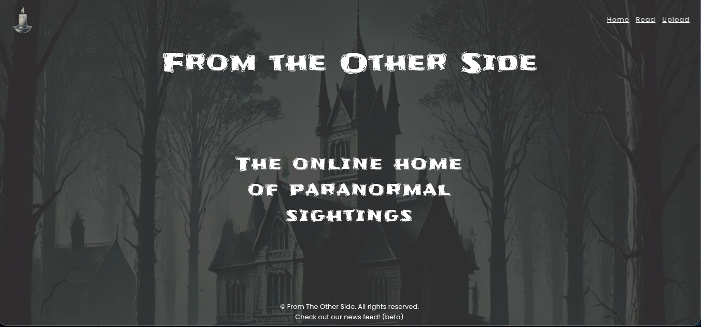
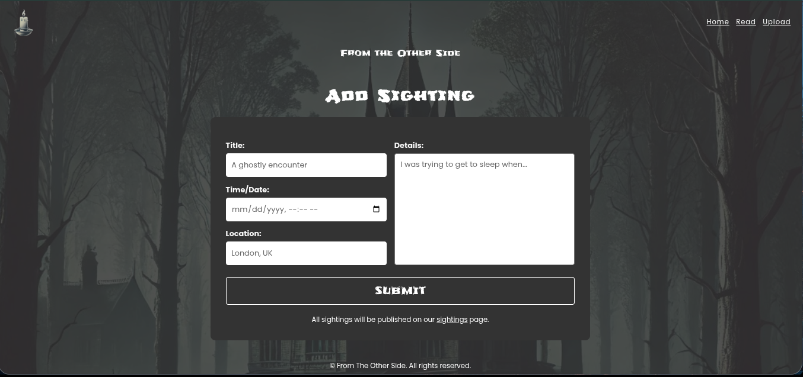

# Paranormal Sightings

A platform for sharing ghostly encounters.

## Preview




## Features

*   View a list of paranormal sightings.
*   Submit your own paranormal sighting.

## Getting Started

### Prerequisites

*   [Node.js](https://nodejs.org/) installed on your machine.

### Installation

1.  Clone the repository:
    ```sh
    git clone https://github.com/0xYurii/paranormal-sightings.git
    ```
2.  Install NPM packages:
    ```sh
    npm install
    ```

### Running the Application

To start the server, run the following command:

```sh
npm start
```

Or for development with automatic restarts:

```sh
npm run dev
```

The application will be available at `http://localhost:8000`. The default port is `8000`, but it can be changed in `server.js`.

## Scripts

-   `npm start`: Starts the server.
-   `npm run dev`: Starts the server in development mode using nodemon.

## Contributing

Contributions are welcome! Please feel free to submit a pull request.